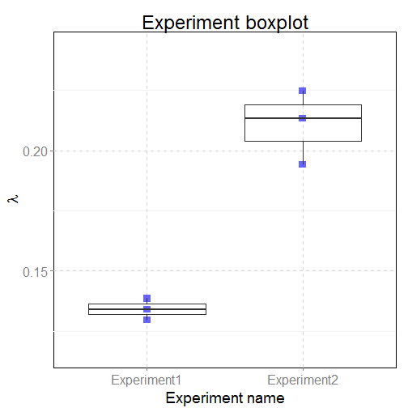
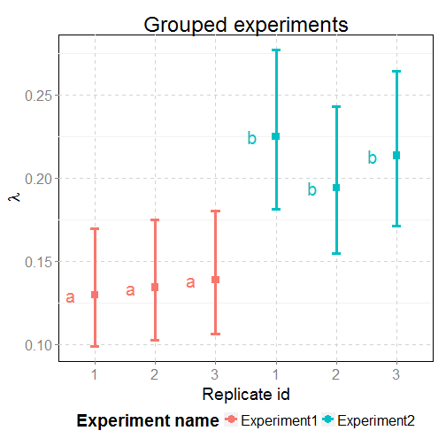

# dpcReport

Report generated on 2015-08-07 14:25:51 using [dpcR](http://github.com/michbur/dpcR) R package.  

Detected input file: none.  

## Data summary table

<!-- html table generated in R 3.2.1 by xtable 1.7-4 package -->
<!-- Fri Aug 07 14:25:51 2015 -->
<table border=1>
<tr> <th>  </th> <th> Run </th> <th> Experiment name </th> <th> Replicate ID </th> <th> Method </th> <th> &lambda; </th> <th> &lambda; (lower CI) </th> <th> &lambda; (upper CI) </th> <th> m </th> <th> m (lower CI) </th> <th> m (upper CI) </th> <th> k </th> <th> n </th>  </tr>
  <tr> <td align="right"> 1 </td> <td> Experiment1.1 </td> <td> Experiment1 </td> <td> 1 </td> <td> dube </td> <td align="right"> 0.13 </td> <td align="right"> 0.10 </td> <td align="right"> 0.16 </td> <td align="right"> 99.16 </td> <td align="right"> 79.25 </td> <td align="right"> 119.59 </td> <td align="right"> 93.00 </td> <td align="right"> 765 </td> </tr>
  <tr> <td align="right"> 2 </td> <td> Experiment1.1 </td> <td> Experiment1 </td> <td> 1 </td> <td> bhat </td> <td align="right"> 0.13 </td> <td align="right"> 0.12 </td> <td align="right"> 0.14 </td> <td align="right"> 99.16 </td> <td align="right"> 88.87 </td> <td align="right"> 109.45 </td> <td align="right"> 93.00 </td> <td align="right"> 765 </td> </tr>
  <tr> <td align="right"> 3 </td> <td> Experiment1.2 </td> <td> Experiment1 </td> <td> 2 </td> <td> dube </td> <td align="right"> 0.13 </td> <td align="right"> 0.11 </td> <td align="right"> 0.16 </td> <td align="right"> 102.58 </td> <td align="right"> 82.32 </td> <td align="right"> 123.40 </td> <td align="right"> 96.00 </td> <td align="right"> 765 </td> </tr>
  <tr> <td align="right"> 4 </td> <td> Experiment1.2 </td> <td> Experiment1 </td> <td> 2 </td> <td> bhat </td> <td align="right"> 0.13 </td> <td align="right"> 0.12 </td> <td align="right"> 0.15 </td> <td align="right"> 102.58 </td> <td align="right"> 92.10 </td> <td align="right"> 113.06 </td> <td align="right"> 96.00 </td> <td align="right"> 765 </td> </tr>
  <tr> <td align="right"> 5 </td> <td> Experiment1.3 </td> <td> Experiment1 </td> <td> 3 </td> <td> dube </td> <td align="right"> 0.14 </td> <td align="right"> 0.11 </td> <td align="right"> 0.17 </td> <td align="right"> 106.02 </td> <td align="right"> 85.40 </td> <td align="right"> 127.21 </td> <td align="right"> 99.00 </td> <td align="right"> 765 </td> </tr>
  <tr> <td align="right"> 6 </td> <td> Experiment1.3 </td> <td> Experiment1 </td> <td> 3 </td> <td> bhat </td> <td align="right"> 0.14 </td> <td align="right"> 0.12 </td> <td align="right"> 0.15 </td> <td align="right"> 106.02 </td> <td align="right"> 95.35 </td> <td align="right"> 116.68 </td> <td align="right"> 99.00 </td> <td align="right"> 765 </td> </tr>
  <tr> <td align="right"> 7 </td> <td> Experiment2.1 </td> <td> Experiment2 </td> <td> 1 </td> <td> dube </td> <td align="right"> 0.22 </td> <td align="right"> 0.19 </td> <td align="right"> 0.26 </td> <td align="right"> 171.96 </td> <td align="right"> 145.21 </td> <td align="right"> 199.67 </td> <td align="right"> 154.00 </td> <td align="right"> 765 </td> </tr>
  <tr> <td align="right"> 8 </td> <td> Experiment2.1 </td> <td> Experiment2 </td> <td> 1 </td> <td> bhat </td> <td align="right"> 0.22 </td> <td align="right"> 0.21 </td> <td align="right"> 0.24 </td> <td align="right"> 171.96 </td> <td align="right"> 158.07 </td> <td align="right"> 185.84 </td> <td align="right"> 154.00 </td> <td align="right"> 765 </td> </tr>
  <tr> <td align="right"> 9 </td> <td> Experiment2.2 </td> <td> Experiment2 </td> <td> 2 </td> <td> dube </td> <td align="right"> 0.19 </td> <td align="right"> 0.16 </td> <td align="right"> 0.23 </td> <td align="right"> 148.53 </td> <td align="right"> 123.84 </td> <td align="right"> 174.04 </td> <td align="right"> 135.00 </td> <td align="right"> 765 </td> </tr>
  <tr> <td align="right"> 10 </td> <td> Experiment2.2 </td> <td> Experiment2 </td> <td> 2 </td> <td> bhat </td> <td align="right"> 0.19 </td> <td align="right"> 0.18 </td> <td align="right"> 0.21 </td> <td align="right"> 148.53 </td> <td align="right"> 135.73 </td> <td align="right"> 161.33 </td> <td align="right"> 135.00 </td> <td align="right"> 765 </td> </tr>
  <tr> <td align="right"> 11 </td> <td> Experiment2.3 </td> <td> Experiment2 </td> <td> 3 </td> <td> dube </td> <td align="right"> 0.21 </td> <td align="right"> 0.18 </td> <td align="right"> 0.25 </td> <td align="right"> 163.24 </td> <td align="right"> 137.25 </td> <td align="right"> 190.15 </td> <td align="right"> 147.00 </td> <td align="right"> 765 </td> </tr>
  <tr> <td align="right"> 12 </td> <td> Experiment2.3 </td> <td> Experiment2 </td> <td> 3 </td> <td> bhat </td> <td align="right"> 0.21 </td> <td align="right"> 0.20 </td> <td align="right"> 0.23 </td> <td align="right"> 163.24 </td> <td align="right"> 149.75 </td> <td align="right"> 176.73 </td> <td align="right"> 147.00 </td> <td align="right"> 765 </td> </tr>
   </table>

### Explanation    
    
1. Name of the run (NameOfExperiment.ReplicateID).    
1. Name of the experiment.    
1. ID of technical replicate.    
1. Method used to compute statistics.    
1. Mean number of template molecules per partition.    
1. Lower border of the confidence interval for the mean number of template molecules per partition.    
1. Upper border of the confidence interval for the mean number of template molecules per partition.    
1. Number of template molecules.    
1. Lower border of the confidence interval for the number of template molecules.    
1. Upper border of the confidence interval for the number of template molecules.    
1. Number of positive partitions.    
1. Total number of partitions.

## Data summary table

 

The boxplot above describes the relationship between the experiment and the &lambda; value. Points belonging to the same experiment and with the same &lambda; value may be overplotted. In this case, consult the replicate/experiment chart below.    
    
TO DO: explain what is boxplot.

 

## Compare runs

## Compare digital PCR experiments    
    
Significance codes:  0 â<U+0080><U+0098>\*\*\*â<U+0080><U+0099> 0.001 â<U+0080><U+0098>\*\*â<U+0080><U+0099> 0.01 â<U+0080><U+0098>\*â<U+0080><U+0099> 0.05 â<U+0080><U+0098>.â<U+0080><U+0099> 0.1 â<U+0080><U+0098> â<U+0080><U+0099> 1    
    
For example, if p-value has value between 0 and 0.001, it has significance code \*\*\*.

<!-- html table generated in R 3.2.1 by xtable 1.7-4 package -->
<!-- Fri Aug 07 14:25:52 2015 -->
<table border=1>
<tr> <th>  </th> <th> Compared pair of runs </th> <th> p-value </th> <th> Significance </th>  </tr>
  <tr> <td align="right"> Experiment1.2 - Experiment1.1 </td> <td> Experiment1.2 - Experiment1.1 </td> <td align="right"> 0.89 </td> <td>   </td> </tr>
  <tr> <td align="right"> Experiment1.3 - Experiment1.1 </td> <td> Experiment1.3 - Experiment1.1 </td> <td align="right"> 0.84 </td> <td>   </td> </tr>
  <tr> <td align="right"> Experiment2.1 - Experiment1.1 </td> <td> Experiment2.1 - Experiment1.1 </td> <td align="right"> 0.00 </td> <td> ** </td> </tr>
  <tr> <td align="right"> Experiment2.2 - Experiment1.1 </td> <td> Experiment2.2 - Experiment1.1 </td> <td align="right"> 0.01 </td> <td> * </td> </tr>
  <tr> <td align="right"> Experiment2.3 - Experiment1.1 </td> <td> Experiment2.3 - Experiment1.1 </td> <td align="right"> 0.00 </td> <td> ** </td> </tr>
  <tr> <td align="right"> Experiment1.3 - Experiment1.2 </td> <td> Experiment1.3 - Experiment1.2 </td> <td align="right"> 0.89 </td> <td>   </td> </tr>
  <tr> <td align="right"> Experiment2.1 - Experiment1.2 </td> <td> Experiment2.1 - Experiment1.2 </td> <td align="right"> 0.00 </td> <td> ** </td> </tr>
  <tr> <td align="right"> Experiment2.2 - Experiment1.2 </td> <td> Experiment2.2 - Experiment1.2 </td> <td align="right"> 0.02 </td> <td> * </td> </tr>
  <tr> <td align="right"> Experiment2.3 - Experiment1.2 </td> <td> Experiment2.3 - Experiment1.2 </td> <td align="right"> 0.00 </td> <td> ** </td> </tr>
  <tr> <td align="right"> Experiment2.1 - Experiment1.3 </td> <td> Experiment2.1 - Experiment1.3 </td> <td align="right"> 0.00 </td> <td> ** </td> </tr>
  <tr> <td align="right"> Experiment2.2 - Experiment1.3 </td> <td> Experiment2.2 - Experiment1.3 </td> <td align="right"> 0.04 </td> <td> * </td> </tr>
  <tr> <td align="right"> Experiment2.3 - Experiment1.3 </td> <td> Experiment2.3 - Experiment1.3 </td> <td align="right"> 0.01 </td> <td> ** </td> </tr>
  <tr> <td align="right"> Experiment2.2 - Experiment2.1 </td> <td> Experiment2.2 - Experiment2.1 </td> <td align="right"> 0.43 </td> <td>   </td> </tr>
  <tr> <td align="right"> Experiment2.3 - Experiment2.1 </td> <td> Experiment2.3 - Experiment2.1 </td> <td align="right"> 0.84 </td> <td>   </td> </tr>
  <tr> <td align="right"> Experiment2.3 - Experiment2.2 </td> <td> Experiment2.3 - Experiment2.2 </td> <td align="right"> 0.70 </td> <td>   </td> </tr>
   </table>

### The mean number of template molecules per partition    
    
Table below contains the mean number of template molecules per partition (&lambda;) and its confidence intervals. The confidence intervals were adjusted to assure stable 0.95 simultaneous coverage probability, which offers more reliable comparision of technical repeats.    
    
The group is assigned automatically to the run by the statistical test and is represented by a single letter (in case of the intermediate groups, a combination of letters). Groups contain experiments which are assessed as similar considering the value of &lambda;.

<!-- html table generated in R 3.2.1 by xtable 1.7-4 package -->
<!-- Fri Aug 07 14:25:52 2015 -->
<table border=1>
<tr> <th>  </th> <th> Run </th> <th> Experiment name </th> <th> Replicate ID </th> <th> Assigned group </th> <th> &lambda; </th> <th> &lambda; (lower CI) </th> <th> &lambda; (upper CI) </th> <th> k </th> <th> n </th>  </tr>
  <tr> <td align="right"> 2 </td> <td> Experiment1.1 </td> <td> Experiment1 </td> <td> 1 </td> <td> a </td> <td align="right"> 0.13 </td> <td align="right"> 0.10 </td> <td align="right"> 0.17 </td> <td align="right"> 93.00 </td> <td align="right"> 765 </td> </tr>
  <tr> <td align="right"> 4 </td> <td> Experiment1.2 </td> <td> Experiment1 </td> <td> 2 </td> <td> a </td> <td align="right"> 0.13 </td> <td align="right"> 0.10 </td> <td align="right"> 0.17 </td> <td align="right"> 96.00 </td> <td align="right"> 765 </td> </tr>
  <tr> <td align="right"> 6 </td> <td> Experiment1.3 </td> <td> Experiment1 </td> <td> 3 </td> <td> a </td> <td align="right"> 0.14 </td> <td align="right"> 0.11 </td> <td align="right"> 0.18 </td> <td align="right"> 99.00 </td> <td align="right"> 765 </td> </tr>
  <tr> <td align="right"> 8 </td> <td> Experiment2.1 </td> <td> Experiment2 </td> <td> 1 </td> <td> b </td> <td align="right"> 0.22 </td> <td align="right"> 0.18 </td> <td align="right"> 0.28 </td> <td align="right"> 154.00 </td> <td align="right"> 765 </td> </tr>
  <tr> <td align="right"> 10 </td> <td> Experiment2.2 </td> <td> Experiment2 </td> <td> 2 </td> <td> b </td> <td align="right"> 0.19 </td> <td align="right"> 0.15 </td> <td align="right"> 0.24 </td> <td align="right"> 135.00 </td> <td align="right"> 765 </td> </tr>
  <tr> <td align="right"> 12 </td> <td> Experiment2.3 </td> <td> Experiment2 </td> <td> 3 </td> <td> b </td> <td align="right"> 0.21 </td> <td align="right"> 0.17 </td> <td align="right"> 0.26 </td> <td align="right"> 147.00 </td> <td align="right"> 765 </td> </tr>
   </table>

 

The chart above shows to which groups runs were assigned using the statistical test. The group is marked by the letter on the left to the point representing the value of lambda.
